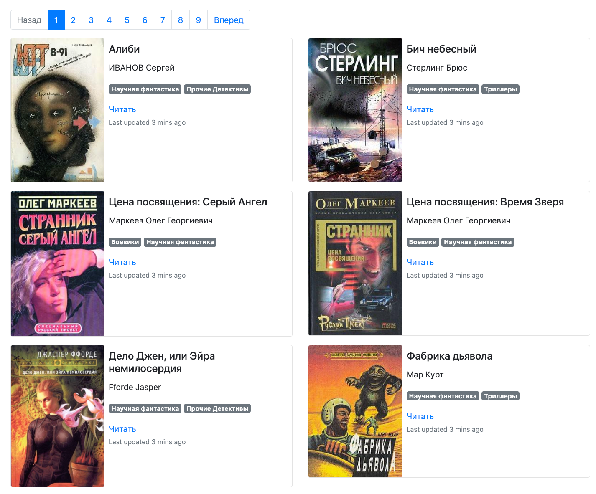

# online_book_library

## Project description

This project is a static website generator based on book data from the `books_details.json` file.
The books were previously downloaded from the `tululu.org` website using a parser from [this project](https://github.com/kashaeva-dev/BooksParser).
The site uses the `template.html` template and `Jinja2` for rendering book pages.
The project also includes automatic reloading using `Livereload`, 
allowing for instant updates to the site when data changes.

## How to install

Clone the repository:
```commandline
git clone https://github.com/kashaeva-dev/online_book_library.git
```

Create a virtual environment:

```commandline
python -m venv env
```

Install the required dependencies:

```commandline
pip install -r requirements.txt
```

## How to use

1. The `books_details.json` file is in the project's root directory. This file contains book information in JSON format. You can add your own books to this file.
Or you can spesify path to your own JSON file when starting the `render_website.py` script:
```commandline
python render_website.py <path_to_your_json_file>
```
Specifying path to your json file is optional. By default the path is
2. The books are in the `media` directory. You can add your own books to this directory. There are two folders: `texts` with books in txt format and `images` with book covers.
3. The template.html file is in the project's root directory. This file contains the template for the book library pages. You can change the template to your liking.
4. Run the render_website file. This will generate book pages and start a web server with automatic reloading. The local server address is http://127.0.0.1:8080/pages/index1.html.
5. Open the local server address in your browser to view the book library.

## Example of the website



## Configuring Livereload
You can also configure monitoring of directories and files to have the site automatically update when changes occur. 
The code already includes monitoring for the `media` directory, the `books_details.json` file,
and the `template.html` template.
If you need to monitor other files or directories, you can add them in the `main()` function in the `render_website.py` file.

## Other usecases

1. You can use the published version of the website at https://kashaeva-dev.github.io/pages/index1.html
2. You can use the offline version of the website. To do this, you need to download the `pages` directory
from the repository and open the `index1.html` file in your browser. The `books_details.json` file,
the `media` directory and the `static` directory must be in the same directory as the `pages` directory.
